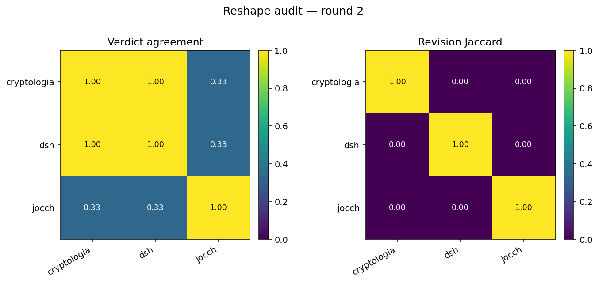

# Reshape audit — round 2

**Date:** 2026-04-20
**Threshold:** 0.70
**Gate rule:** either metric > threshold on more than one pair → FAIL

## Interpretation (top)

Across 3 target pair(s), the publication-target feature is doing differentiating work: verdict-agreement peaks at 1.00 (mean 0.56) and revision-request Jaccard peaks at 0.00 (mean 0.00). The reshape lenses produce distinct reviewer outputs, not three variants of the same review with different dossier text prepended. **Oryx metric-review flag (small-sample honesty):** this round has 3 personas and 3 target-pairs. With 3 personas the verdict-agreement rate only takes values in {0.00, 0.33, 0.67, 1.00}, which makes a 0.70 threshold coarse by construction. Treat the gate as a smoke signal, not a precision instrument, until the panel grows.

## Pairwise metrics

| Pair | Verdict agreement | Revision Jaccard | JS-divergence (3-way verdict) | Breach? |
|---|---:|---:|---:|---|
| cryptologia × dsh | 1.00 | 0.00 | 0.000 | **yes** (verdict_agreement) |
| cryptologia × jocch | 0.33 | 0.00 | 0.318 | no |
| dsh × jocch | 0.33 | 0.00 | 0.318 | no |

## Gate verdict

**PASS** — no metric exceeds threshold on more than one pair.

## Per-target verdicts parsed

| Target | Personas | Verdicts | Aggregate |
|---|---:|---|---|
| cryptologia | 3 | manifold_learning_skeptic=REVISE, probing_methodology=REVISE, stats_methods=ACCEPT | REVISE |
| dsh | 3 | manifold_learning_skeptic=REVISE, probing_methodology=REVISE, stats_methods=ACCEPT | REVISE |
| jocch | 3 | manifold_learning_skeptic=ACCEPT, probing_methodology=ACCEPT, stats_methods=ACCEPT | ACCEPT |

## Heatmap

